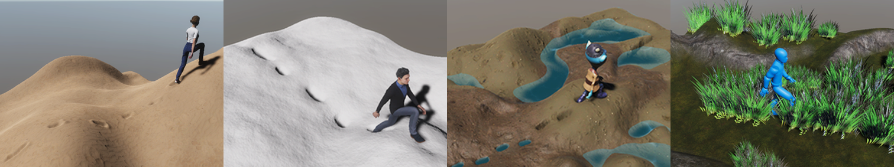

# Soft Walks: Real-Time, Two-Ways Interaction between a Character and Loose Grounds

- [Introduction](#Introduction)
- [Citation](#Citation)
- [License](#License)

## Introduction

This repository provides the codes used to reproduce the results shown in the following paper: **Soft Walks: Real-Time, Two-Ways Interaction between a Character and Loose Grounds**. Chloé Paliard, Eduardo Alvarado, Damien Rohmer, Marie-Paule Cani. Short-Paper. Eurographics 2021.

A project webpage associated to this article is available at: ***in progress*.**

## Citation

***In progress***

## License

The code is released under MIT License. See LICENSE for details.